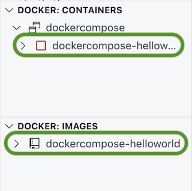
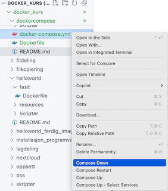

# Docker compose


## Oppsummering

I denne oppgaven skal vi se på hvordan vi kan sette opp en eller flere containere med docker compose.

## Hensikt

Demonstrere hvordan vi konfigurerer:

- en enkelt container med docker compose
- flere containere i ett miljø


## Fremgangsmåte

### Opprett dockerfile

- Opprett `Dockerfile` i katalogen `/workspaces/docker_intro/dockercompose/` med følgene innhold:

```dockerfile
FROM ubuntu
ENV melding="Hello NVE"
CMD ["bash", "-c", "echo Melding er: ${melding}"]
```

### Bygg og test image

- Bygg og test imaget og sjekk at det skriver ut en melding tilsvarende i oppgaven [hello world](../helloworld/README.md)

### Opprett docker-compose

- Opprett en fil ved navn `docker-compose.yml` og legg inn dette innholdet:

```
services:
  helloworld:
    build: .
```

### Ta opp miljø


- Høyreklikk på `docker-compose.yml` og velg `Compose Up`:


Du skal nå se noe liknende dette i terminalen:

```
 To do so, set COMPOSE_BAKE=true.
[+] Building 0.9s (6/6) FINISHED                                                                  docker:default
 => [helloworld internal] load build definition from Dockerfile                                             0.0s
 => => transferring dockerfile: 120B                                                                        0.0s
 => [helloworld internal] load metadata for docker.io/library/ubuntu:latest                                 0.9s
 => [helloworld internal] load .dockerignore                                                                0.0s
 => => transferring context: 2B                                                                             0.0s
 => CACHED [helloworld 1/1] FROM docker.io/library/ubuntu:latest@sha256:6015f66923d7afbc53558d7ccffd325d43  0.0s
 => [helloworld] exporting to image                                                                         0.0s
 => => exporting layers                                                                                     0.0s
 => => writing image sha256:b8f1391f83c6401b0d634a7087dcb3a0f56f658022fac364235bbef8549edbc2                0.0s
 => => naming to docker.io/library/dockercompose-helloworld                                                 0.0s
 => [helloworld] resolving provenance for metadata file                                                     0.0s
[+] Running 3/3
 ✔ helloworld                            Built                                                              0.0s 
 ✔ Network dockercompose_default         Created                                                            0.0s 
 ✔ Container dockercompose-helloworld-1  Started       
```

I Visual Studio Code vises et image og en kjørende container:



Dette representerer et lite, isolert miljø med en kjørende container.

### Vis logger

- Vis loggene fra miljøet:


Du skal nå se denne meldingen i loggen:

```
Melding er: Hello NVE
```


### Ta ned miljø

- Ta ned miljøet med `Compose down`:



### Bruk kommandolinjen

Vi skal nå gjøre det samme med kommandlinjen.

- Ga til oppgavekatalogen:
  - `cd /workspaces/docker_intro/dockercompose/`
- Ta opp miljøet:
    - `docker-compose up`
- Ta ned miljøet:
    - `docker-compose down`

### Sett miljøvariabel

- Oppdater `docker-compose.yml`. Sett miljøvariabelen `melding`:

```dockerfile
services:
  helloworld:
    build: .
    environment:
      melding: Jasså?
```

- Start miljøet på nytt og verifiser at ny melding skrives ut:

```
Melding er: Jasså?
```


### Lag miljø med to containere

Vi skal nå settes opp et miljø med to containere som kommuniserer med hverandre.

- Åpne filen `docker-compose.yml` i katalogen `webapp`:


```
services:
  postgres:
    image: postgres:15
    restart: always
    environment:
      POSTGRES_USER: myuser
      POSTGRES_PASSWORD: mypassword
      POSTGRES_DB: mydb
    ports:
      - "5432:5432"
    volumes:
      - ./db-init:/docker-entrypoint-initdb.d
  app:
    build: ./app
    ports:
      - "3000:3000"
    environment:
      - PGHOST=postgres
      - PGUSER=myuser
      - PGPASSWORD=mypassword
      - PGDATABASE=mydb
      - PGPORT=5432
    depends_on:
      - postgres
```

I denne filen definerer vi to tjenester:

  1. En databaseserver som kjører [postgres](../oss/hvaer_postgres.md)
  1. En applikasjon implementert i [node.js](../oss/hvaer_nodejs.md) som kobler seg opp mot databasen.


Forklaring:

- linje 2
    - vi starter definisjon av en ny tjeneste "postgres"
- linje 3
    - tjenesten skal brukes ferdigbygd image `postgres:15`
- linje 5 - 8
    - her setter vi opp miljøvariabler som brukes av postgres
- linje 9 - 10
    - vi deler porten 5432
- linje 11 - 12
    - vi deler porten 5432
- linje 13
    - her begynner definisjon av tjenesten `app``
- linje 14
    - her angir vi at tjenesten `app` skal bygges ved hjelp av `Dockerfile` som ligger i samme katalog som `docker-compose.yml`
- linje 15
    - tilsvarende som for tjeneste postgres
- linje 23-24
    - her angir vi at containeren `app` er avhengig av `postgres`

Containere er ofte avhengig av hverandre. F.eks. kan ikke webapplikasjoner starte opp før databasen er oppe å går. 

Det at en container er avhengig av en annen, indikerer man ved å si at containeren `depends_on` en annen container. Det betyr at tjenesten vil vente til den andre tjenesten er klar.

Her er en figur som viser miljøet:


### Ta opp miljø

- Ta opp miljøet ved hjelp av container extension eller opprett med kommandolinjen:
  - `cd webapp`
  - `docker-compose up`

### Sjekk miljøet

 - Åpne denne adressen i nettleseren:
	 - http://localhost:3000/


Det er nå opprettet et internt nettverk mellom containerene Den ene containerenen kan nå de andre med DNS-navn over dette interne nettverket.

Du kan inspisere det virtuelle nettverket slik:

- I extension "Containers", gjør følgende:
  - Åpne seksjonen "Networks" og verifiser at nettverket vises:


Dette kan du sjekke at det er kontakt mellom containerene ved å pinge den ene containeren fra den andre:

- I extension "Containers", gjør følgende:
  - Høyreklikk på `webapp-app` og velg "Attach shell":


Det skal nå vises en kommandolinje tilsvarende denne:

```bash
root@7f5048ba73f8:/app# 
```

- Installer programmet [ping](../oss/hvaer_ping.md)

```bash
apt update
apt install iputils-ping
```

- Gjør en `ping` til postgres (den andre containeren):

```bash
ping postgres
```

Ping skal nå vise at det er kontakt mellom containerene:

```
PING postgres (172.19.0.2) 56(84) bytes of data.
64 bytes from webapp-postgres-1.webapp_default (172.19.0.2): icmp_seq=1 ttl=64 time=0.274 ms
64 bytes from webapp-postgres-1.webapp_default (172.19.0.2): icmp_seq=2 ttl=64 time=0.066 ms
```

I filen `/webapp/app/index.js` (i oppgavekatalogen) kan du se at webapp kan referere til DNS-navnet til postgres:

```js
const pool = new Pool({
  user: 'myuser',
  host: 'postgres',
  database: 'mydb',
  password: 'mypassword',
  port: 5432,
});
```


## Opprydning

- Ta ned miljøet:
    - `docker-compose down`

- Slett alle images