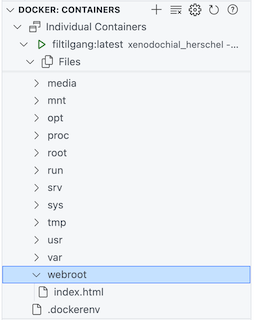

# Filkopiering


## Oppsummering

I denne oppgaven skal vi se på hvordan vi kan kopiere filer fra verstsmaskinen inn til containeren.

## Hensikt

Demonstrere

- hvordan vi kan overføre filer til containeren under bygging
- at filer som er kopiert inn ikke endres i container dersom de endres på vertsmaskin


## Fremgangsmåte

### Opprett dockerfile

- Opprett `Dockerfile` i katalogen `/workspaces/docker_intro/filkopiering/` med følgene innhold:

```
FROM ubuntu
RUN apt update
RUN apt install -y python3
COPY ../webroot /webroot
CMD ["python3","-m","http.server","8080", "--directory", "/webroot"]
EXPOSE 8080
```

- Forklaring:
    - Linje 4:
        - Her kopierer vi katalogen `webroot` inn i containeren
    - Linje 5:
        - Her angir vi web- roten til tjeneren


### Bygg og start

- Bygg, start image


### Test webside

- I nettleser, gå til `localhost:8080`
    - du skal nå se en vakker hjemmeside
### Inspiser filer

- Åpne filtreet i Visual Studio Code og verifiser at filene ligger der:



Siden filene nå er kopiert inn, vil ikke siden endre seg dersom du endrer på filene i katalogen webroot (utenfor containeren). Du kan gjerne teste dette ved å endre på `index.html` utenfor kontaineren og bekrefte at siden ikke endres når du frisker opp nettleseren.

I oppgaven [fildeling](../fildeling/README.md) skal vi se på hvordan vi deler filer istedenfor å kopiere de inn.

## Opprydning

- Slett containeren
- Slett image
