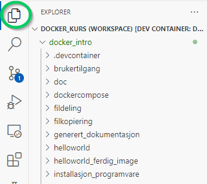
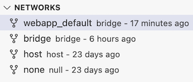

# Introduksjon til docker

Under presenteres hver av seksjonene i kurset:

## Presentasjon og info

Denne seksjonen inneholder info om selve kurset.


- Se kurspresentasjon og info for instruktører

## Om bruk av git

Kurset bruker git og github for lagring av kursinnholdet. Kurset forutsetter grunnleggende kompetanse på versjonskontrollsystemer.

## Oppsett

Før vi begynner med oppgavene må vi sette opp lokalt miljø.

Følg instruksene her:


- Seksjon Oppsett

## Oppgaver

### Hello world

For å komme gang med docker starter vi med den klassiske programmeringsoppgaven: hello world

Vi skal lære å lage et image nesten fra bunnen av og tar oppsatt operativsystem og bygger på med egen funksjonalitet.

- Oppgave: Hello World


### Lagdeling

Docker bruker lag for å representere endringer mellom images aller versjoner av images.

- Oppgave: Lagdeling


### Tilkobling til terminal

Det er nyttig å koble til kjørende containere med terminal for å se tilstand på de.

- Oppgave: Tilkobling terminal

### Installasjon av programvare

En styrke med docker, er at vi kan sette opp nødvendig programvare sammen med vår egen programvare. Vi skal se på hvordan man installerer programvare i et docker image.

- Oppgave: Installasjon av programvare


### Tjener

Docker brukes ofte til til å lage forskjellige typer tjenere. Vi skal se hvordan vi kan opprette en enkel tjener.

- Oppgave: Tjener


### Filkopiering

Docker trenger, utover programvare, vanligvis egne filer. I denne oppgaven ser vi på hvordan vi kopierer inn filer fra vertsmaskinen ved bygging av image.

- Oppgave: Filkopiering


### Fildeling

I noen tilfeller ønsker vi å dele filer til containeren slik at filene endres i container når de endres på vertsmaskin. I denne oppgaven ser vi på deling av filer fra vertsmaskin til container.

- Oppgave: Fildeling


### Brukertilgang

For å oppnå sikker bruk av docker, er det en del hensyn å ta. Et vanlig problem, er at containere kjører som adminstratorbruker (kalt root) i containeren

- Oppgave: Brukertilgang

### Tags

I docker bruker vi tags for å angi varianter av docker images. I denne oppgaven skal vi sette tags og bruke dem.

- Oppgave: Tags

### Docker compose

Ved hjelp av Docker Compose kan vi beskrive en applikasjon som består av flere containere i én konfigurasjonsfil, og så starte alt med én kommando. Vi bruker det for å slippe manuell håndtering av individuelle `docker run`-kommandoer, noe som gir enklere oppsett, felles nettverk/volumer og forenkler opprettelse av reproduserbare miljøer.

I denne oppgaven skal vi opprette en applikasjon som kjører i et miljø med flere containere.

- Oppgave: Docker compose


# Kurspresentasjon og info for instruktører

Denne seksjonen inneholder info om:

 - Kurspresentasjon - som bør holdes ved oppstart av kurset
 - Filstruktur - med info om filstruktur som brukes i kurset
 - Utviklingsmiljø - med info om utviklingsmijøet som brukes for gjennomføring av kurset.
 - Teknisk info - med info for personer som skal holde eller  videreutvikle kurset


 


## Kurspresentasjon

### Tidsplan

| Tid | Aktivitet |
| ---  | ------ |
| 0000 - 0010  | Kloning av repo og verifikasjon av miljø |
| 0010 - 0030  | Presentasjon av kursopplegg |
| 0100 - 0330  | Gjennomføring av oppgaver |

Tiden er gjengitt i tid relativ til oppstart av kurset.

### Hensikt

Kursets hensikt er:

- å få praktisk kjennskap til grunnlegende bruk av docker

### Retningslinjer

 - Oppgavene skal gjennomføres i praksis av hver deltaker
 - Man kan gjerne jobbe sammen i grupper, men alle skal gjennomføre oppgavene
 - Når oppgavene er gjennomført, kan man gjerne leke/ improvisere opp nye oppgaver
 - Deltakere tar pauser ved behov
 - Bruk instruktører dersom dere står fast
 - Koble deg opp på Teams. Spør gjerne spørsmål i kanalen.

### Typopgrafi og konvensjoner

 - Bruk README.md i rotkatalogen som utgangspunkt for navigering i innholdet
 - Det er opprettet en katalog for hvert kurs (for mer info, se filstruktur)
 - Det er benyttet en bestemt typgrafi i oppgaveteksten:
    - Linjer med punkt foran (slik som denne) indikerer at noe skal utføres av deltakeren
    - Linjer uten punkt foran er til informasjon


### Forutsetninger

Programvare må være installert som angitt i instruks for oppsett


### Merknader

Visual Studio Code Extension "docker" endret navn til "Container Tools" i samme periode som kurset ble utviklet. Det være steder der referanser ikke er oppdatert.


## Utviklingsmiljø

Kurset er satt opp med et eget utviklingsmiljø basert på dev containers som skal brukes under gjennomføring.

Det er mulig å gjennomføre kurset uten å bruke det, men ikke anbefalt.

Miljøet er teknisk sett i seg selv en docker container. Vi kommer med andre ord til å utvikle docker images og containere i en docker container (dette kalles docker-i-docker). Dette har i seg selv liten praktisk betydning for deltakerne, men en av fordelene er at vi får et isolert miljø der vi kan skape images og containere uten å påvirke oppsett på vertsmaskinen. Vi får også et miljø som er konsistent på tvers av ulike operativsystem og oppsettet på vertsmaskiner.

Utviklingsmiljøet er satt opp med Linux, noen som gjør at kurset i seg selv gir en enkel innføring i grunnleggende bruk av Linux.

Se seksjon oppsett for info om hvordan miljøet settes opp.


## Filstruktur

Kurset skal legges i en mappe som heter `docker_intro`. Det er valgfritt hvor denne mappen ligger, nen mappen må ha nøyaktig det navnet.

### Oppgavekatalog

Hver oppgave i kurset ligger i hver sin katalog, f.eks:):

- `helloworld`
- `brukertilgang`
- `dockercompose`
- `fildeling`
- `filkopiering`

Alle oppgaver har filstruktur som likner denne (eksempelet er tatt fra oppgaven "tjener"):

```

└── tjener
    ├── fasit
    ├── README.md
    ├── resources
    └── skripter

```

Legg dine oppgavebesvarelser i hver oppgavekatalog.

Filene og katalogene har denne betydningen:


- `README.md` - Hoveddokument for hver oppgave. Start her.
- `resources` - ressursfiler (bilder o.l.) som brukes av `README.md`
- `fasit` - Filer som inneholder hele eller deler av fasit. Kan brukes om du står fast.
- `skripter` - skripter/ programmer som kan brukes for å teste installasjon og/ eller rydde opp. Skal inneholdet skriptet `ryddop.sh` som rydder opp containere, images m.m.

### Andre kataloger

Rotkatalogen har i tillegg andre nyttige kataloger:

- `oss` - Inneholder info/ ofte stilte spørsmål. Kan brukes for oppslagsverk.
- `generert_dokumentasjon` - inneholder dokumentasjon for kurset i formater som word, pdf o.l. Disse genereres fra Markdown.
- `doc` - Dokumentasjon om selve kurset.
- `.devcontainer` - Oppsett av utviklingsmiljø
- `nextcloud` - Valgfri oppgave/ demo for oppsett av komplett kontorstøtteapplikasjon.


## Teknisk info

Informasjonen under er nyttig for de som skal videreutvikle kurset eller være kursholder.

### Installasjon av utviklingsverktøy

Du trenger en del programmer for å generere dokumentasjon eller utvikle på koden i kurset. For å redusere tiden det tar å sette opp miljø i devcontainer, så er en del av disse programmer utelatt fra miljøet. Nødvendig programvare installeres med dette skriptet:

```bash
/workspaces/docker_intro/skripter/installerutviklingsverktoy.sh
```


### Fellesskripter

I katalogen `skripter`under hovedkatalogen finnes følgende skripter som kan være nyttige:

- `env.sh` - Setter felles miljøvariabler. Kalles fra andre skripter
- `genererdiagrammer.sh` - Genererer diagrammer (forutsetter installasjon av utviklingsverktøy, se over)
- `genererdokumentasjon.sh`  - Genererer dokumentasjon i forskjellige formater (forutsetter installasjon av utviklingsverktøy, se over)
- `installerutviklingsverktoy.sh` - Se over
- `konverterfiler.sh` - Konverterer filer i evt. Windowsformat over til unix og setter eksekverbarflagg på skripter. Kalles automatisk ved installasjon av dev container.
- `ryddopp.sh` - Fjerner alle containere og images. Nyttig for feilsøking.
- `testalt.sh` - Kjører alle skripter for alle oppgaver. Nyttig for verifikasjon av feilsøking.

# Oppsett

## Installasjon av programvare

1. For Windows: Installer WSL (Windows Subsystem for Linux)
    1. Følg instruksen "Install WSL Command" på Microsoft sine sider:
        - https://learn.microsoft.com/en-us/windows/wsl/install#install-wsl-command
1. Installer Docker Desktop
1. Installer Visual Studio Code
1. Installer extension "Dev Containers" i VSCode:
    - https://marketplace.visualstudio.com/items?itemName=ms-vscode-remote.remote-containers
1. Installer git (se (https://gitforwindows.org/)[https://gitforwindows.org/])

## Kloning og åpning av prosjekt

Prosjektet er laget som et versjonskontrollert prosjekt i github.

***OBS!*** Det kan ta inntil 10 minutter å sette opp miljøet.

Det kan klones med Visual Studio Code slik:

- Velg meny: `File` -> `New Window`

Nytt vindu vises. Sjekk ut prosjektet:

- Trykk `Ctrl` + `Shift` + `p` (windows) / `Cmd` + `P` (mac)
- Skriv:
    - `> Git clone`
- Velg Clone from github
- Logg deg inn i github hvis du blir bedt om det
- Skriv:
    - `https://github.com/NVE/docker_intro`
- Velg en valgfri katalog
- Vent til prosjektet er klonet
- Når du får spørsmålet "Would you like to open the cloned repository?", velger du "Open in New Window"

Når prosjektet er åpent, vises disse to meldingene:


- Velg både "Reopen i container" og "Open Workspace"

_Merk! Denne operasjonen kan ta litt tid!_

Du skal nå ha et prosjekt som ser ca. slik ut:


- Sjekk at følgende vises i nederste venstre hjørne:


- Sjekk at følgende Container Tools extension er installert:


## Test

Gjør følgende for å teste at docker fungerer i miljøet:

- Opprett et nytt terminalvindu i Visual Studio Code.

Denne kommandolinjen skal vises i Visual Studio Code i terminalvinduet:

```bash
vscode ➜ /workspaces/docker_intro (main) $ 
```

- Lim inn inn denne kommandoen:

```bash
docker run --rm hello-world
```
Denne teksten skal skal vises (noen avvik kan forekomme):

```txt
Unable to find image 'hello-world:latest' locally
latest: Pulling from library/hello-world
c9c5fd25a1bd: Already exists 
Digest: sha256:dd01f97f252193ae3210da231b1dca0cffab4aadb3566692d6730bf93f123a48
Status: Downloaded newer image for hello-world:latest

Hello from Docker!
This message shows that your installation appears to be working correctly.

To generate this message, Docker took the following steps:
 1. The Docker client contacted the Docker daemon.
 2. The Docker daemon pulled the "hello-world" image from the Docker Hub.
    (arm64v8)
 3. The Docker daemon created a new container from that image which runs the
    executable that produces the output you are currently reading.
 4. The Docker daemon streamed that output to the Docker client, which sent it
    to your terminal.

To try something more ambitious, you can run an Ubuntu container with:
 $ docker run -it ubuntu bash
x
Share images, automate workflows, and more with a free Docker ID:
 https://hub.docker.com/

For more examples and ideas, visit:
 https://docs.docker.com/get-started/
```

Hvis alt fungerer, kan du begynne på oppgavene (se hovedsiden)


## Feilsøking

### Rebygging av miljø

Dersom det oppstår feil, forsøk dette:

- Trykk `Ctrl` + `Shift` + `p` (windows) / `Cmd` + `P` (mac)
- Skriv:
    - `> Dev Containers: Rebuild Container Without Cache`

### Full test

For å gjøre en grundig test av at miljøet fungerer, gjør følgende:

- Opprett et nytt terminalvindu i Visual Studio Code.

Denne kommandolinjen skal vises i Visual Studio Code i terminalvinduet:

```bash
vscode ➜ /workspaces/docker_intro (main) $ 
```

- Lim inn inn denne kommandoen:

```bash
./skripter/testalt.sh
```

Alle oppgavene skal nå kjøres gjennom og testes.

Merk at dette tar ganske lang tid.

Merk også at det vises noen feilmeldinger om man forsøker å slette containere og images som ikke eksisterer. Det er helt normalt.

### Command failed: C:\VSCode-NVE\Code.exe og Run: docker ps -q -a

Hvis du får følgende feilmeldinger eller liknende:

```
Start: Run: docker ps -q -a --filter label=devcontainer.local_folder=c:\Temp-docker\docker_intro --filter label=devcontainer.config_file=c:\Temp-docker\docker_intro\.devcontainer\devcontainer.json
[58252 ms] Error: Command failed: docker run --sig-proxy=false -a STDOUT -a STDERR --mount type=bind,source=c:\Temp-docker\docker_intro,target=/workspaces/docker_intro,consistency=cached --mount type=volume,src=dind-var-lib-docker-1f46ccrd484ivd9a5mv619904fpsd0n04669semnhasc3hm00aid,dst=/var/lib/docker --mount type=volume,src=vscode,dst=/vscode --mount type=bind,src=\\wsl.localhost\Ubuntu\mnt\wslg\runtime-dir\wayland-0,dst=/tmp/vscode-wayland-a76d3e3a-e92f-4629-9b33-0b81ef9a7051.sock -l devcontainer.local_folder=c:\Temp-docker\docker_intro -l devcontainer.config_file=c:\Temp-docker\docker_intro\.devcontainer\devcontainer.json --privileged --entrypoint /bin/sh vsc-docker_intro-7e368a42f641fd4f5c4f4e9495091c6f64ebe6ac3d79ec234e848c21d6654da2 -c echo Container started
Command failed: C:\VSCode-NVE\Code.exe c:\Users\nick\.vscode\extensions\ms-vscode-remote.remote-containers-0.413.0\dist\spec-node\devContainersSpecCLI.js up --user-data-folder 
```

... gjør dette:

- Åpne Docker Desktop -> Settings -> Resources -> WSL Integration
- Kryss av for «Enable integration with my default WSL distro» og marker også Ubuntu (eller den distribusjonen feilmeldingen viser til).
- Klikk Apply & Restart for å starte Docker Desktop på nytt.
- Gå tilbake til VS Code og kjør «Dev Containers: Rebuild and Reopen in Container».


# Hello World

## Oppsummering

I denne oppgaven skal vi se på hvordan vi kan definere et veldig enkelt image og kjøre det i en container

## Hensikt

Demonstrere hvordan 

- vi konfigurerer et enkelt image
- starter og stopper container basert på image

## Fremgangsmåte

### Opprett Dockerfile

- Opprett en fil som heter `Dockerfile` i katalogen `/workspaces/docker_intro/helloworld`


Angi ubuntu som basis:

```
FROM ubuntu
```

Docker images baserer seg på basisimager som vi bygger videre på. I dette tilfellet operativsystemet ubuntu.

### Bygg image


Vi skal ny-bygge imaget:

1. Høyreklikk på `Dockerfile`
1. Velg *Build image...*
1. Når VSCode spør om tag, skriv: `helloworld`


Du skal nå ha et image opprettet. Dette vises i Docker extension i VSCode:


Dette er et såkalt image, som inneholder alt som kreves for å starte et operativsystem og inkludert programvare.

### Start container

Du kan nå starte en container med det imaget. Dette gjør du ved å høyreklikke på det og velge "Run":


Hvis alt gikk bra, var det tilsynelatende lite som skjedde. En container ble startet, fant ut at den hadde ingen ting å gjøre og ble avsluttet. I bakgrunnen har det imidlertid skjedd mye. Et operativsystem har blitt lastet ned. satt opp, startet og avsluttet.

I vinduet "Terminal" skal det ha blitt skrevet noe som likner på dette:

```bash
 *  Executing task in folder vscode: docker run --rm -d helloworld:latest 

 3e06b4be79a8c53e7ec3f32342857cc9bad3a6dd4d1d83113a012934e38278ba
```

### Legg til mer funksjonalitet

Legg til denne linjen til `Dockerfile`:

```
ENV melding="Hello NVE"
CMD ["bash", "-c", "echo Melding er: ${melding}"]
```

Forklaring:

- Linje 1
    - vi setter en miljøvariabelen `melding` til verdien "Hello NVE"
- Linje 2
    - her skriver vi ut teksten "Melding er" etterfulgt av verdien av miljøvariabelen
    - linjen ser litt kompliser ut, men består av fire ganske enkle deler som betyr følgende:
        - `CMD` - angir at det skal kjøres en kommando
        - `bash` - vi skal starte bash (som skal brukes til å utføre kommandoen)
        - `-c` er et flagg som sende til bash for å indikerer at vi kan bruke variabler o.l. i kommandoer
        - `echo Melding er: ${melding}`  - vi skal skrive ut en melding
	        - `echo` betyr at vi skal skrive ut noe (tilsvarende `console.log` o.l.)
	        - `Melding er:` er statisk tekst (streng)
	        - `${melding}` variabelen som skal skrives ut

For at disse endringene skal ta effekt må vi først bygge imaget på nytt. Vi kan da følge samme metode som vi gjorde tidligere som er å gå tilbake til fil-utforskeren



og så

1. Høyreklikk på `Dockerfile`
2. Velg *Build image...*
3. Når VSCode spør om tag, skriv: `helloworld`


Kjør deretter imaget interaktivt, slik:


Hvis alt gikk bra skal du se noe som likner på dette:

```bash
Melding er: Hello NVE
```

### Utfør operasjonene fra kommandolinjen

- Opprett et nytt terminalvindu i Visual Studio Code.
- Følgende kommandolinje skal vises:

```bash
vscode ➜ /workspaces/docker_intro/helloworld (master)
```

- Skriv inn følgene kommandoer:
    - Gå til katalogen for denne oppgaven:
        - `cd helloworld`
    - Bygg image:
        - `docker build . -t helloworld`
    - Start container:
        - `docker run --rm --name helloworld -it helloworld`

Linjene over vil bli forklart i mer detalj i senere oppgaver.

_Tips:_ Du kan bruke tab for automcomplete i terminalen


### Neste oppgave

Hvis alt fungerer, kan du begynne på neste oppgave (se hovedsiden)

De neste oppgavene kommer ikke til å gjengi alle kommendoer og operasjoner som er utført i denne oppgaven. Gå gjerne tilbake til denne oppgaven hvis du trenger oppfriskning på f.eks hvordan du bygger et image eller kjører en container.


# Hello World med ferdig image

Denne gangen skal vi spare oss bryet med å legge inn programmet som skriver hello world.

## Opprett Dockerfile

Opprett en fil som heter `Dockerfile`

## Angi basis image

Docker images baserer seg på basisimager. 

Angi hello-world som basis:

```
FROM hello-world
```

Dette imaget skriver ut noe tekst og avslutter. for mer info, se:
- https://hub.docker.com/_/hello-world/

For å kjøre imaget, bygg og kjør:

1. Bygg image
1. Start image (run interactive)

Hvis alt gikk bra, skal du se noe som likner på dette:

```
Hello from Docker!
This message shows that your installation appears to be working correctly.

(..)
```

Hvis du ser teksten, gikk alt bra!

Slett imaget før du går videre.


# Lagdeling

## Oppsummering

I denne oppgaven skal vi se på hvordan docker bruker lag.

Lagene i docker images kan sammenliknes med lag på en kake der hvert lag bygger på de andre:


Dersom man gjør endringer i `Dockerfile` vil det resultere i et nytt layer som bygger videre på de eksisterende. 

Hvert layer identifiseres av en SHA256-hash. Denne vil endres dersom innholdet i et image endres, og er derfor garantert unike.

Et layer skrives til disk bare èn gang, men kan brukes av flere images. Dersom vi endrer et image og legger til et nytt layer kan det brukes i flere images, men det lagres bare èn gang. 

Hvert layer kan beskrives som en samling av diff'er fra underliggende layers, eller som en serie commits til et repo.

## Hensikt

Demonstrere

- at docker bruker lag for å representere endringer i images
- vi kan opprette `Dockerfile`r for å lage imager som bygger videre på andre images.

## Fremgangsmåte


### Bygg image helloworld

- Bygg image i oppgaven Hello World

### Definer nytt image som bygger på helloworld

- Opprett følgende `Dockerfile` i katalogen `/workspaces/docker_intro/lagdeling`:

```Dockerfile
FROM helloworld
ENV melding="Hello NVE! Nå med lag!"
```

Forklaring:

- linje 1
	- vi skal bygge videre på helloworld
- linje 2
	- vi endrer miljøvariabelen `melding` som vi tidligere definerte i helloworld

### Kjør nytt image

- Bygg og kjør image i terminalen:

```bash
cd /workspaces/docker_intro/lagdeling
docker build . -t lagdeling
docker run --name lagdeling lagdeling
```

Følgende melding skal vises på skjermen:

```
Melding er: Hello NVE! Nå med lag!
```

- Nå skrives den nye verdien til miljøvariabelen `melding` ut
- Hvis du kjører imaget `helloworld`, skrives den gamle meldingen ut:

```
Melding er: Hello NVE
````

- Vi har nå bygget et nytt image `lagdeling` som bygger videre på `helloworld`

### Inspiser lagene

- Opprett en ny terminal i Visual Studio

- Vi kan inspisere lagene med kommandoen `history`. For å se lagene til `helloworld`, skriv dette i terminalen:

```bash
docker history helloworld
```

- Du skal få en tekst som likner på dette:

```bash
vscode ➜ /workspaces/docker_intro/lagdeling/skripter (master) $ docker history helloworld
IMAGE          CREATED      CREATED BY                                      SIZE      COMMENT
b04ca4b27355   8 days ago   CMD ["bash" "-c" "echo Melding er: $melding"]   0B        buildkit.dockerfile.v0
<missing>      8 days ago   ENV melding=Hello NVE                           0B        buildkit.dockerfile.v0
<missing>      8 days ago   /bin/sh -c #(nop)  CMD ["/bin/bash"]            0B        
(..))
```

- Legg merke til de to øverste linjene (se kolonne `CREATED BY`):

    - `CMD ["bash" "-c" "echo Melding er: $melding"]`
    - `ENV melding=Hello NVE`

- Dette viser at det er opprettet to lag. Ett lag for hver linje i `Dockerfile`

- For å se lagene til `lagdeling`, skriv dette i terminalen:

```bash
docker history lagdeling
```

- Du skal få en tekst som likner på dette:

```bash
vscode ➜ /workspaces/docker_intro/lagdeling/skripter (master) $ docker history lagdeling
IMAGE          CREATED      CREATED BY                                      SIZE      COMMENT
71e52e650dda   8 days ago   ENV melding=Hello NVE! Nå med lag!              0B        buildkit.dockerfile.v0
<missing>      8 days ago   CMD ["bash" "-c" "echo Melding er: $melding"]   0B        buildkit.dockerfile.v0
<missing>      8 days ago   ENV melding=Hello NVE                           0B        buildkit.dockerfile.v0
(..)
```

- Legg merke til denne linjen:
    - `ENV melding=Hello NVE! Nå med lag!`

- Dette viser at det er opprettet et nytt lag som ligger oppå de andre lagene

## Opprydning

- Kjør disse to kommandoene i terminalvinduet: 
	- `docker image rm lagdeling`
	- `docker image rm helloworld`


Forklaring:

- linjene over er bygget opp av fire deler:
	- `docker` - docker- programmet
	- `image` - angir at vi skal gjøre noe med ett eller flere images
	- `rm` - vi skal slette images
	- `lagdeling` - navn på image


Hvis du vil, kunne du isteden også slettet dem som vist i oppgaven hello world


## Neste oppgave

Hvis alt fungerer, kan du begynne på neste oppgave (se hovedsiden)


# Tilkobling med terminal


## Oppsummering

I denne oppgaven skal vi se på hvordan vi kan koble oss til en kjøre docker container og utføre kommandoer

## Hensikt

Demonstrere

- hvordan vi starter en container med interaktiv terminal
- hvordan vi kobler oss opp mot en kjørende container


## Fremgangsmåte

### Opprett image

- Opprett `Dockerfile` i katalogen `/workspaces/docker_intro/tilkobling_terminal/` med følgene innhold:

```
FROM ubuntu
```
### Bygg og start image

- Bygg image basert på `Dockerfile`:
    - høyreklikk på fil og velg `Build image`
    - angi følgende navn: `tilkobling_terminal`

### Koble til interaktive terminal

- Start image i interaktiv modus
    - I vindu "Containers: Images":
        - høyreklikk på image `tilkobling_terminal` > `latest`
        - velg "Run interactive"


Visual Studio viser nå en prompt (kommandolinje) i et terminalvindu:

```bash
root@3a2899245da9:/#
```

- ***Tips:*** Du kan også starte en interaktiv kommandolinje direkte fra terminalen:
    - `docker run --rm -it tilkobling_terminal`


### Utfør kommandoer

- Du kan nå kjøre forskjellige kommandoer:
    - Vis liste over filer og kataloger med kommandoen `dir`
    - Bytt katalog med kommandoen `cd`, f.eks:
        - `cd /home/ubuntu/`
    - Skriv ut en melding på konsollet kommandoen `echo`, f.eks:
        - `echo Hello NVE!`

- Du kan gjerne også teste ut andre kommandoer
    - Merk at noen av de krever at programmer er installert (f.eks `nano`). Det docker imaget vi har brukt er minimert for å redusere størrelsen.

### Installer og kjør programvare manuelt

- Vi skal nå installere noen programmer på imaget.
    - Først må vi oppdatere liste over tilgjengelige pakker.
        - Skriv `apt update`
    - Installer programmet `cowsay` og `fortune`:
        - For å installere programmer i Linux bruker man operativsystemets integrerte package manager. For Ubuntu er dette `apt`
        - Skriv `apt install cowsay` -> du får spørsmål `Do you want to continue? [Y/n]` aksepter med `enter` eller `y`
        - Gjør det samme for `fortune`

- Test programmet `fortune`:
    - `/usr/games/fortune`
    - Du skal nå få en oppmuntrende melding, f.eks:

```bash
root@dba090c7e0ec:/# /usr/games/fortune 
Give your very best today.  Heaven knows it's little enough.
```

- Test programmet `cowsay`:
    - `/usr/games/cowsay Moooo NVE!`
    - Du skal nå få en ku med melding:

```
root@dba090c7e0ec:/# /usr/games/cowsay Moooo NVE!
 ____________
< Moooo NVE! >
 ------------
        \   ^__^
         \  (oo)\_______
            (__)\       )\/\
                ||----w |
                ||     ||
```

### Logg ut

- Logg deg ut av terminalen:
    - `exit`

## Opprydning

- Containeren skal ha blitt fjernet etter å ha skrevet `exit` i terminalen, men dersom den ikke er det:
    - I vindu "Containers: Containers":
        - Høyreklikk på container `tilkobling_terminal`
        - velg `Remove...` og aksepter advarsel

- Slett image


# Installasjon av programvare


## Oppsummering

I denne oppgaven skal vi se på hvordan vi installerer programvare i et docker image.

## Hensikt

Demonstrere hvordan vi

- installerer programvare i et image


## Fremgangsmåte


### Opprett image

- Opprett `Dockerfile` i katalogen `/workspaces/docker_intro/installasjon_programvare/` med følgene innhold:

```dockerfile
FROM ubuntu
RUN apt update
RUN apt install -y cowsay
CMD ["/usr/games/cowsay", "MmmooOOOoohoo iiiIIuuuUURRRR"]
```
og bygg imaget på vanlig måte.

- Forklaring:
    - linje 1
        - vi baserer oss på standard ubuntu- installasjon
    - linje 2
        - vi oppdatere listen over pakker ved hjelp av apt
    - linje 3
        - vi installerer programmet cowsay ved hjelp av apt
            - flagget `-y` betyr at vi ikke trenger å akseptere installasjon manuelt med tasten "y"
    - linje 4
        - `cowsay` skal startes ved oppstart og gir en melding på terminalen

Du har nå et image som installerer programvaren `cowsay` under bygging og starter det når image kjøres.
### Kjør container

- Start image
    - Hvis du vil, kan du starte det i terminalen:
        - `docker run --rm -it installasjon_programvare`

- Du skal nå se en melding i terminalen som likner på dette:

```
 ______________________________
< MmmooOOOoohoo iiiIIuuuUURRRR >
 ------------------------------
        \   ^__^
         \  (oo)\_______
            (__)\       )\/\
                ||----w |
                ||     ||
```

## Opprydning

- Slett image


## Neste oppgave

Hvis alt fungerer, kan du begynne på neste oppgave (se hovedsiden)


# Tjener


## Oppsummering

I denne oppgaven skal vi se på hvordan vi kan sette opp en enkel webserver i docker.


## Hensikt

Demonstrere

- hvordan vi setter opp en enkel webserver og kobler oss til med nettleser


## Fremgangsmåte


### Opprett image

- - Opprett `Dockerfile` i katalogen `/workspaces/docker_intro/tjener/` med følgene innhold:

```dockerfile
FROM ubuntu
RUN apt update
RUN apt install -y python3
CMD ["python3","-m","http.server","8080"]
EXPOSE 8080
```

- Forklaring:
    - Linje 5:
        - Angir at vi vil dele port 8080

### Bygg og start image

- Bygg og start image (tag denne med navnet `tjener`)
- Visual studio skal nå komme opp med en melding om en åpen port. Velg "Open in Browser"
    - Alternativt, kan du åpne denne adressen i nettleseren din:
        - http://localhost:8080/

- Du skal nå se noe liknende dette i nettleseren:


Du har nå en enkel, kjørende webtjener som viser innholdet i roten i dockercontaineren.

I dette eksempelet vises roten i filsystemet, noe vi vanligvis ikke ønsker. I oppgaven filkopiering skal vi se på hvordan vi setter opp en webside.


## Opprydning

- Slett containeren
- Slett image


## Neste oppgave

Hvis alt fungerer, kan du begynne på neste oppgave (se hovedsiden)


# Brukertilgang


## Oppsummering

I denne oppgaven skal vi se på hvordan vi skal unngå å bruke root- bruker i docker imager for å unngå at vi kjører programvare som adminstratorbruker i container.

## Hensikt

Demonstrere

- hvordan vi skifter fra privilegert bruker (root) til upriviligert bruker
- hvilken effekt dette har på brukerens tilgang


## Fremgangsmåte


### Opprett docker image med rot- tilgang

- Opprett `Dockerfile` i katalogen `/workspaces/docker_intro/brukertilgang/` med følgene innhold:

```dockerfile
FROM ubuntu
```

### Bygg og start image

- Bygg og start image interaktivt.
	- Hvis du vil, kan du gjøre det i terminal:
		- `cd /workspaces/docker_intro/brukertilgang`
		- `docker build . -t brukertilgang`
		- `docker run --rm -it --name brukertilgang brukertilgang`

Du skal nå få en prompt som viser at du er logget inn med brukeren `root`:
```bash
root@73afd15771b6:/$
```

### Ødelegg container

- Kjør følgende kommandoer i terminalen:

- `cd /`
- `ls`
- `rm /usr/bin/ls`
- `ls`

Forklaring:

- Linje 1 (`cd \`)
    - her går vi opp til den øverste (rotkatalogen) i operativsystemet
- Linje 2 (`ls`)
    - vi lister ut innholdet ved hjelp av kommanoen `ls`
- Linje 3 (`rm`)
    - vi sletter kommanoen `ls`
- Linje 4 (`ls`)
    - vi forsøker å kjøre kommandoen `ls`, men den er nå slettet
    - vi får denne feilmeldingen:
        - `bash: /usr/bin/ls: No such file or directory`

Dette er et eksempel på at brukeren har fått lov til å gjøre noe ingen burde kunne gjøre.

Hvis du vil, kan du forsøke å slette flere filer og se når operativsystemet går i stykker.

- Logg ut av containeren:
    - `exit`

### Oppdater docker image med ny bruker

- Oppdater `Dockerfile` med følgene innhold:

```dockerfile
FROM ubuntu
RUN useradd -m -s /bin/bash appuser
USER appuser
```

Forklaring:

- Linje 2 (`RUN useradd`)
    - her kjører vi kommandoen `useradd` for å opprette en ny brukerkonto
    - argumentene `-m` gjør at vi oppretter home directory for den nye brukeren og `s` spesifiserer at vi skal bruke /bin/bash shell
    - til slutt sier vi hva brukernavnet skal være: `appuser` 
- Linje 3 (`USER`)
    - her bytter vi til brukeren `appuser`

### Forsøk å ødelegge container

- Bygg image, start container og logg inn

Du skal nå få en prompt som viser at du er logget inn med brukeren `appuser`:

```bash
appuser@a7afd15771b6:/$
```

- Forsøk å slette `ls` som vist ovenfor.

Du skal nå få en bekreftelse på at du vil slette `ls`:

```bash
rm: remove write-protected regular file '/usr/bin/ls'? 
```

- Bekreft med "y"

Du skal nå få denne feilmeldingen:

```bash
rm: cannot remove '/usr/bin/ls': Permission denied
```

Hvis du vil kan du gjerne se hvor mye skade du klarer å gjøre. Forsøk også gjerne å bytte til rotbruker med kommadoen `su -` for å se om du kan gjøre mer skade på den måten.

## Opprydning

- Slett containerene
- Slett alle image


## Neste oppgave

Hvis alt fungerer, kan du begynne på neste oppgave (se hovedsiden)


# Tags


## Oppsummering

I denne oppgaven skal vi se på hvordan vi kan bruke tags for å versjonere og angi varianter av images.


## Hensikt

Demonstrere

- hvordan vi kan bruke tags for angi versjoner av images
- at vi kan sette flere tags på samme image for versjonering som f.eks. prod og dev

## Fremgangsmåte


### Opprett dockerfile

- Opprett `Dockerfile` i katalogen `/workspaces/docker_intro/tags` med følgene innhold:

```dockerfile
FROM ubuntu
ENV melding="Versjon 1"
CMD ["bash", "-c", "echo Jeg er: $melding"]
```

### Bygg image

- Høyreklikk på Dockerfile
    - Velg `Build Image...`
    - Når du blir bedt om tag, skriv:
        - `tags:v1`

- I vinduet "Container tools: Images", verifiser at versjon 1 vises:

```
 --tags
   -- v1
```

### Start versjon 1

- Høyreklikk på v1
    - Velg "Run interactive"

Følgende melding skal vises i terminalen:

```
Jeg er: Versjon 1
```

### Opprett versjon 2

- Endre linje 2 i `Dockerfile` til å vise en ny melding:

```dockerfile
ENV melding="Versjon 2"
```

- Bygg image. Når du blir bedt om tag, skriv:
    - `tags:v2`
- Start `v2` interaktivt (`Run interactive`)

Følgende melding skal vises i terminalen:

```
Jeg er: Versjon 2
```

- I vinduet "Docker: Images", verifiser at versjon 2 vises:

```
 --tags
   -- v1
   -- v2
```

### Merk som prod

Vi skal nå merke versjon 2 som produksjonsversjon.

- I vinduet "Docker: Images", høyreklikk på `v2`, velg `Tag...` og angi følgende tag:
    - `tags:prod`

- Kjør image med tag "prod"
- Verifiser at den skriver ut versjon 2

### Opprett versjon 3


- Endre linje 2 i `Dockerfile` til å vi en ny melding:

```dockerfile
ENV melding="Versjon 3"
```

- Gå til oppgavekatalogen:
    - `cd /workspaces/docker_intro/tags`
- Bygg og sett tag: `tags:v3` på kommandlinjen:

```bash
docker build . -t tags:v3
```

### Merk som dev


- Sett `dev` på `v3` og kjør image med tag `dev` på kommandolinjen:

```bash
docker tag tags:v3 tags:dev
```

- Verifiser at det er versjon 3:

```bash
docker run tags:dev
```

### List ut tags

- List opp alle images med tags på kommandolinjen:

```bash
docker image ls
```

Du skal nå få en opplisting liknende denne:

```
REPOSITORY   TAG       IMAGE ID       CREATED      SIZE
tags         prod      692b5311b296   7 days ago   78.1MB
tags         v2        692b5311b296   7 days ago   78.1MB
tags         dev       df44803bbe6a   7 days ago   78.1MB
tags         v3        df44803bbe6a   7 days ago   78.1MB
tags         v1        71a67e221258   7 days ago   78.1MB
```

## Opprydning

- Slett alle containere
- Slett alle images


## Neste oppgave

Hvis alt fungerer, kan du begynne på neste oppgave (se hovedsiden)


# Docker compose


## Oppsummering

I denne oppgaven skal vi se på hvordan vi kan sette opp en eller flere containere med docker compose.

## Hensikt

Demonstrere hvordan vi konfigurerer:

- en enkelt container med docker compose
- flere containere i ett miljø


## Fremgangsmåte

### Opprett dockerfile

- Opprett `Dockerfile` i katalogen `/workspaces/docker_intro/dockercompose/` med følgene innhold:

```dockerfile
FROM ubuntu
ENV melding="Hello NVE"
CMD ["bash", "-c", "echo Melding er: ${melding}"]
```

### Bygg og test image

- Bygg og test imaget og sjekk at det skriver ut en melding tilsvarende i oppgaven hello world

### Opprett docker-compose

- Opprett en fil ved navn `docker-compose.yml` og legg inn dette innholdet:

```
services:
  helloworld:
    build: .
```

### Ta opp miljø


- Høyreklikk på `docker-compose.yml` og velg `Compose Up`:


Du skal nå se noe liknende dette i terminalen:

```
 To do so, set COMPOSE_BAKE=true.
[+] Building 0.9s (6/6) FINISHED                                                                  docker:default
 => [helloworld internal] load build definition from Dockerfile                                             0.0s
 => => transferring dockerfile: 120B                                                                        0.0s
 => [helloworld internal] load metadata for docker.io/library/ubuntu:latest                                 0.9s
 => [helloworld internal] load .dockerignore                                                                0.0s
 => => transferring context: 2B                                                                             0.0s
 => CACHED [helloworld 1/1] FROM docker.io/library/ubuntu:latest@sha256:6015f66923d7afbc53558d7ccffd325d43  0.0s
 => [helloworld] exporting to image                                                                         0.0s
 => => exporting layers                                                                                     0.0s
 => => writing image sha256:b8f1391f83c6401b0d634a7087dcb3a0f56f658022fac364235bbef8549edbc2                0.0s
 => => naming to docker.io/library/dockercompose-helloworld                                                 0.0s
 => [helloworld] resolving provenance for metadata file                                                     0.0s
[+] Running 3/3
 ✔ helloworld                            Built                                                              0.0s 
 ✔ Network dockercompose_default         Created                                                            0.0s 
 ✔ Container dockercompose-helloworld-1  Started       
```

I Visual Studio Code vises et image og en kjørende container:


Dette representerer et lite, isolert miljø med en kjørende container.

### Vis logger

- Vis loggene fra miljøet:


Du skal nå se denne meldingen i loggen:

```
Melding er: Hello NVE
```


### Ta ned miljø

- Ta ned miljøet med `Compose down`:


### Bruk kommandolinjen

Vi skal nå gjøre det samme med kommandlinjen.

- Ga til oppgavekatalogen:
  - `cd /workspaces/docker_intro/dockercompose/`
- Ta opp miljøet:
    - `docker compose up`
- Ta ned miljøet:
    - `docker compose down`

### Sett miljøvariabel

- Oppdater `docker-compose.yml`. Sett miljøvariabelen `melding`:

```dockerfile
services:
  helloworld:
    build: .
    environment:
      melding: Jasså?
```

- Start miljøet på nytt og verifiser at ny melding skrives ut:

```
Melding er: Jasså?
```


### Lag miljø med to containere

Vi skal nå settes opp et miljø med to containere som kommuniserer med hverandre.

- Åpne filen `docker-compose.yml` i katalogen `webapp` (som er inne i mappen `dockercompose`):


```
services:
  postgres:
    image: postgres:15
    restart: always
    environment:
      POSTGRES_USER: myuser
      POSTGRES_PASSWORD: mypassword
      POSTGRES_DB: mydb
    ports:
      - "5432:5432"
    volumes:
      - ./db-init:/docker-entrypoint-initdb.d
  app:
    build: ./app
    ports:
      - "3000:3000"
    environment:
      - PGHOST=postgres
      - PGUSER=myuser
      - PGPASSWORD=mypassword
      - PGDATABASE=mydb
      - PGPORT=5432
    depends_on:
      - postgres
```

I denne filen definerer vi to tjenester:

  1. En databaseserver som kjører postgres
  1. En applikasjon implementert i node.js som kobler seg opp mot databasen.


Forklaring:

- linje 2
    - vi starter definisjon av en ny tjeneste "postgres"
- linje 3
    - tjenesten skal brukes ferdigbygd image `postgres:15`
- linje 5 - 8
    - her setter vi opp miljøvariabler som brukes av postgres
- linje 9 - 10
    - vi deler porten 5432
- linje 11 - 12
    - vi deler porten 5432
- linje 13
    - her begynner definisjon av tjenesten `app`
- linje 14
    - her angir vi at tjenesten `app` skal bygges ved hjelp av `Dockerfile` som ligger i samme katalog som `docker-compose.yml`
- linje 15
    - tilsvarende som for tjeneste postgres
- linje 23-24
    - her angir vi at containeren `app` er avhengig av `postgres`

Containere er ofte avhengig av hverandre. F.eks. kan ikke webapplikasjoner starte opp før databasen er oppe å går. 

Det at en container er avhengig av en annen, indikerer man ved å si at containeren `depends_on` en annen container. Det betyr at tjenesten vil vente til den andre tjenesten er klar.

Her er en figur som viser miljøet:


### Ta opp miljø

- Ta opp miljøet ved hjelp av container extension eller opprett med kommandolinjen:
  - `cd webapp`
  - `docker compose up -d`

### Sjekk miljøet

 - Åpne denne adressen i nettleseren:
	 - http://localhost:3000/

Du skal nå få servert meldingen
```
Hello NVE! Its me! From PostgreSQL!
```

Det er nå opprettet et internt nettverk mellom containerene Den ene containerenen kan nå de andre med DNS-navn over dette interne nettverket.

Du kan inspisere det virtuelle nettverket slik:

- I extension "Containers", gjør følgende:
  - Åpne seksjonen "Networks" og verifiser at nettverket vises:




Dette kan du sjekke at det er kontakt mellom containerene ved å pinge den ene containeren fra den andre:

- I extension "Containers", gjør følgende:
  - Høyreklikk på `webapp-app` og velg "Attach shell":


Det skal nå vises en kommandolinje tilsvarende denne:

```bash
root@7f5048ba73f8:/app# 
```

- Installer programmet ping

```bash
apt update
apt install iputils-ping
```

- Gjør en `ping` til postgres (den andre containeren):

```bash
ping postgres
```

Ping skal nå vise at det er kontakt mellom containerene:

```
PING postgres (172.19.0.2) 56(84) bytes of data.
64 bytes from webapp-postgres-1.webapp_default (172.19.0.2): icmp_seq=1 ttl=64 time=0.274 ms
64 bytes from webapp-postgres-1.webapp_default (172.19.0.2): icmp_seq=2 ttl=64 time=0.066 ms
```

I filen `/webapp/app/index.js` (i oppgavekatalogen) kan du se at webapp kan referere til DNS-navnet til postgres:

```js
const pool = new Pool({
  user: 'myuser',
  host: 'postgres',
  database: 'mydb',
  password: 'mypassword',
  port: 5432,
});
```


## Opprydning

- Ta ned miljøet:
    - `docker-compose down`

- Slett alle images


## Neste oppgave

Hvis alt fungerer, kan du begynne på neste oppgave (se hovedsiden)


# Ressurser


## Ofte stilte spørsmål


### Hva er apt?

`apt` (Advanced Package Tool) er et kommandolinjeverktøy for å installere, oppdatere og administrere programvare på Debian-baserte Linux-systemer som Ubuntu. Det henter pakker fra programvarelagre (repositories) og håndterer avhengigheter automatisk.

Vanlige kommandoer inkluderer `apt install`, `apt update` og `apt upgrade`.


### Hva er bash?

Bash (Bourne Again SHell) er et kommandolinjeskall og skriptspråk brukt i Linux og macOS. Det lar deg kjøre kommandoer, automatisere oppgaver og skrive skript.  

Bash er standard skall i mange Unix-lignende systemer.  Du kan bruke det til å navigere filer, starte programmer og håndtere prosesser.  


### Hva er en docker container?

En container er en kjørende instans av et Docker-image.

Den er isolert med egne prosess-, nettverks- og filsystem.

Alle endringer som skjer mens den kjører lagres i et midlertidig skrivbart lag, slik at imaget selv forblir uendret.

Containeren kan startes, stoppes og slettes med enkle kommandoer, og hele miljøet kan gjenskapes når som helst ved å kjøre imaget på nytt.


### Hva er cowsay?

cowsay er et lite, humoristisk Linux-program som får en ku (eller andre figurer) til å "snakke". Du skriver en tekst, og cowsay viser den som snakkeboble fra en ASCII-ku.

Eksempel: 

`cowsay Hei verden!`

Programmet støtter også andre figurer enn kuer, f.eks. Tux eller drager.

Det brukes mest for moro skyld i terminalen og som "easter egg" i skript eller motiverende meldinger.


### Hva er fortune?

fortune er et kommandolinjeprogram som viser et tilfeldig sitat eller visdomsord hver gang du kjører det. sDet trekker meldinger fra tekstfiler som inneholder alt fra visdomsord og vitser til nerdete referanser.

Programmet ble opprinnelig laget for Unix-systemer og finnes ofte i Linux-distribusjoner.

Det brukes mest for moro skyld, gjerne i kombinasjon med cowsay.

Eksempel: 

```bash
fortune | cowsay
```

Kommandoen viser et sitat sagt av en ASCII-ku.


### Hva er github?

GitHub er en nettbasert plattform for lagring og samarbeid på kodeprosjekter som bruker Git som versjonskontrollsystem. 

Den gjør det enkelt for utviklere å dele kode, samarbeide, og holde oversikt over endringer i prosjektet.

GitHub tilbyr også funksjoner som issues, prosjekttavler og CI/CD-integrasjon. Tjenesten brukes både til åpne kildekodeprosjekter og private bedriftsprosjekter. Microsoft eier GitHub siden 2018.


### Hva er git?

Git er et versjonskontrollsystem som brukes til å spore endringer i filer og samarbeide om kode. Hver utvikler har en komplett kopi av hele prosjektets historikk lokalt. Endringer gjøres lokalt og flettes deretter sammen til en kopi på en server.

Git lagrer alle endringer noe som gjør at man kan gå tilbake i tid eller sammenligne versjoner.

Systemet brukes bredt i moderne programvareutvikling, særlig sammen med plattformer som GitHub og GitLab.

### Hva er et docker image?

Et Docker-image er en skrivebeskyttet mal som inneholder alle filene og innstillingene et program trenger. Det bygges vanligvis fra en Dockerfile, hvor hver instruks legger til et nytt lag. Når du starter en container, kopieres imaget til en kjørbar kopi med et eget skrivbart lag på toppen. 

### Hva er en miljøvariabel?

En miljøvariabel er en nøkkel-verdi-par som lagres i operativsystemets miljø.  Den kan for eksempel brukes til å konfigurere hvordan programmer oppfører seg uten å endre kildekoden. Miljøvariabler kan settes midlertidig i terminalen eller permanent i systeminnstillinger.  

Eksempler er databasepassord, portnummer eller API-nøkler.  

I Docker og Docker Compose brukes de ofte for å konfigurere containere.

### Hva er Node.js?

Node.js er en åpen kildekode plattform for å kjøre JavaScript utenfor nettleseren. Den brukes ofte til å lage raske og skalerbare serverapplikasjoner. Den har et stort økosystem via npm (Node Package Manager). Node.js er populær for både API-er, sanntidstjenester og verktøyutvikling.

### Hva er ping?

Ping er et kommandolinjeverktøy echo-forespørsler til en angitt adresse. Det brukes til å gi en rask diagnostikk av internett- og lokalnettproblemer.

Verktøyet viser om verten kan nås, og gir indikasjon på nettverkstilkoblingen.

Hver mottatt «echo-reply» måles for rundturstid (latency), slik at du ser hvor raskt pakken kommer frem og tilbake. 


### Hva er PostgrSQL?

PostgreSQL (ofte kalt Postgres) er et avansert, åpen kildekode databasesystem. Postgres støtter komplekse spørringer, relasjoner, og ACID-transaksjoner. Det er kjent for høy stabilitet, datasikkerhet og fleksibilitet. Postgres brukes ofte i webapplikasjoner, analyse og som grunnmur i store systemer.

### Hva er Ubuntu?

Ubuntu er et gratis og åpen kildekode-operativsystem basert på Linux. Det er kjent for å være brukervennlig og passer både for nybegynnere og erfarne brukere. Ubuntu vedlikeholdes av selskapet Canonical og får regelmessige sikkerhetsoppdateringer. Systemet brukes både på skrivebord, servere og i skyplattformer. Det finnes også i mange varianter, som Ubuntu Server og Ubuntu Desktop.

### Hva er et volume?

Et Docker-volume er en lagringsressurs som docker oppretter og vedlikeholder utenfor containerens image.

Data som lagres der, slettes ikke når containeren stoppes, oppgraderes eller fjernes, og kan deles mellom flere containere.

Dete gir vedvarende, portable og backup-vennlige data uten å binde deg til en bestemt sti på verten.

Du oppretter volumet med docker volume create og monterer det i containere via `-v` eller `--mount`-flagget.


### Hvorfor viser docker-historikken "missing" på noen av lagene?

Når docker history viser <missing>, betyr det at Docker mangler metadata for det laget. Dette skjer ofte når basisbildet er slettet eller ryddet bort med docker image prune. Det kan også skje hvis bildet er importert fra en .tar-fil eller laget med --squash, som fjerner historikk. Selve lagene finnes fortsatt på disk, så bildet fungerer. Du ser bare ikke hele byggeprosessen bak.

### Hvordan åpner jeg terminalvinduet i Visual Studio Code?

1. Bruk følgende menyvalg:
    - Terminal -> New Terminal
2. Et nytt terminalvindu åpnes og følgende tekst (prompt) vises:
    - `vscode ➜ /workspaces/docker_intro (master) $`


### Hva er en prompt, og hvordan tolker jeg den?

Her er eksempler på prompter:

```bash
root@a5c839dac946:/#
```

```bash
gunnar@laptop:~/prosjekt
```

En Linux-prompt er teksten som vises i terminalen for å signalisere at skallet/ kommandolinjen (f.eks. bash eller zsh) er klart til å motta en kommando.

Typisk inneholder den brukernavn, vertnavn og gjeldende arbeidskatalog.

En typisk Linux-prompt er ofte (og i eksemplene ovenfor) satt sammen av flere deler:

- Brukernavn – navnet på kontoen som er logget inn.
- Alfakrøll og vertsnavn – skiller brukernavn fra navnet på maskinen du sitter på, f.eks. `@laptop`.
- Kolon og gjeldende katalog – viser hvor du befinner deg i filsystemet, som `~/prosjekt`.
- Prompt-symbol ($ eller #) – $ for vanlig bruker, # for root; signaliserer også at skallet venter på ny kommando.

Det er mulig å gjøre tilpasninger på promptet som i eksempelet som brukes i Visual Studio før du går inni en terminal:

```bash
vscode ➜ /workspaces/docker_intro/brukertilgang/fasit (master) $
```

Her vises git branch i tillegg til `(master)`.

### Hva er root?

Root er den mest privilegerte brukeren i et Unix- eller Linux-system, med full tilgang til alle filer og kommandoer. Root kan installere programvare, endre systeminnstillinger og få tilgang til alle brukeres data. Denne brukeren brukes ofte til administrasjon, men feil bruk kan føre til alvorlige sikkerhetshull. I Docker-kontekst betyr det at containere som kjører som root kan få uønsket tilgang til vertssystemet. Derfor anbefales det å bruke en begrenset bruker inne i containere for bedre sikkerhet.

### Hva betyr flagget --it når jeg kjører docker run?

Flagget --it i docker run er en kombinasjon av to flagg:

- `-i` (interactive): Holder standard input (stdin) åpen, slik at du kan skrive inn kommandoer.
- `-t` (tty): Allokerer et pseudo-terminal, slik at du får en "ekte" terminalopplevelse.

Sammen gjør --it det mulig å bruke terminalen interaktivt. Da får du et interaktivt shell inne i containeren. Uten --it ville det bare kjørt kommandoen og lukket seg.

### Hva betyr flagget --rm når jeg kjører docker run?

Flagget --rm gjør at Docker automatisk sletter containeren når den stopper. Du slipper å rydde opp med docker rm etterpå. Det er nyttig for midlertidige tester og engangskjøring. Uten --rm blir containeren liggende selv etter at den er ferdig. Med --rm forsvinner den med én gang den avsluttes.

### Hvilke er de mest vanlige kommandoene i bash?

| Kommando | Beskrivelse                                              | Eksempel                      |
| -------- | -------------------------------------------------------- | ----------------------------- |
| `ls`     | Lister filer og mapper                                   | `ls -l`                       |
| `cd`     | Bytt katalog (change directory)                          | `cd /home/user`               |
| `pwd`    | Viser nåværende katalog (print working directory)        | `pwd`                         |
| `mkdir`  | Lager ny mappe                                           | `mkdir ny_mappe`              |
| `touch`  | Lager en ny tom fil                                      | `touch fil.txt`               |
| `rm`     | Sletter filer eller mapper                               | `rm fil.txt`, `rm -r mappe`   |
| `cp`     | Kopierer filer eller mapper                              | `cp fil.txt kopi.txt`         |
| `mv`     | Flytter eller gir nytt navn til filer                    | `mv gammel.txt ny.txt`        |
| `cat`    | Viser innholdet i en fil                                 | `cat /etc/os-release`         |
| `echo`   | Skriver tekst til terminal eller fil                     | `echo "hei"`                  |
| `nano`   | Tekstredigerere i terminal (krever installasjon av nano) | `nano fil.txt`                |
| `sudo`   | Kjør som administrator (superbruker)                     | `sudo apt update`             |
| `apt`    | Installerer programvare (Debian/Red Hat)                 | `sudo apt install curl`       |
| `top`    | Viser kjørende prosesser                                 | `top`                         |
| `ps`     | Viser aktive prosesser                                   | `ps aux`                      |
| `kill`   | Stopper prosesser                                        | `kill 1234`                   |
| `chmod`  | Endrer rettigheter på filer                              | `chmod +x script.sh`          |
| `chown`  | Endrer eier av fil                                       | `chown bruker:gruppe fil.txt` |
| `find`   | Søker etter filer og mapper                              | `find . -name "*.txt"`        |
| `grep`   | Søker etter tekst i filer                                | `grep "hei" fil.txt`          |
| `whoami` | Viser hvilken bruker du kjører som                       | `whoami`                      |
| `yes`    | Repeterer en streng i det uendelige                      | `yes Klaatu barada nikto`           |


## Tips

## Bruk av tab for autocomplete i terminal

I bash (kommandolinjen i Linux) kan du rbuke Tab-tasten til autoutfulling (autocomplete). Når du trykker Tab, forsøker Bash å fullføre kommandoer, filnavn, mapper eller variabler basert på det du har begynt å skrive. Hvis det finnes flere muligheter, kan du trykke Tab to ganger raskt for å vise en liste over alternativer.


