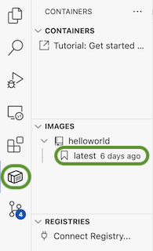
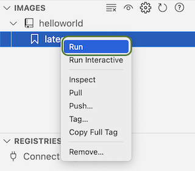
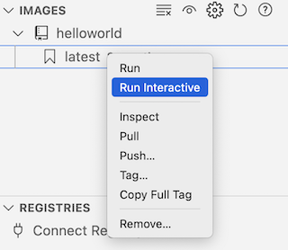

# Hello World

## Oppsummering

I denne oppgaven skal vi se på hvordan vi kan definere et veldig enkelt [image](../oss/hvaer_image.md) og kjøre det i en container

## Hensikt

Demonstrere hvordan 

- vi konfigurerer et enkelt image
- starter og stopper container basert på image

## Fremgangsmåte

### Opprett Dockerfile

- Opprett en fil som heter `Dockerfile` i katalogen `/workspaces/docker_intro/helloworld`


Angi [ubuntu](../oss/hvaer_ubuntu.md) som basis:

```
FROM ubuntu
```

Docker images baserer seg på basisimager som vi bygger videre på. I dette tilfellet operativsystemet [ubuntu](../oss/hvaer_ubuntu.md).

### Bygg image


Vi skal ny bygge imaget:

1. Høyreklikk på `Dockerfile`
1. Velg *Build image...*
1. Når VSCode spør om tag, skriv: `helloworld`


Du skal nå ha et image opprettet. Dette vises i Docker extension i VSCode:



Dette er et såkalt image, som inneholder alt som kreves for å starte et operativsystem og inkludert programvare.

### Start container

Du kan nå starte en [container](../oss/hvaer_container.md) med det imaget. Dette gjør du ved å høyreklikke på det og velge "Run":



Hvis alt gikk bra, var det tilsynelatende lite som skjedde. En [container](../oss/hvaer_container.md) ble startet, fant ut at den hadde ingen ting å gjøre og ble avsluttet. I bakgrunnen har det imidlertid skjedd mye. Et operativsystem har blitt lastet ned. satt opp, startet og avsluttet.

I vinduet "Terminal" skal det ha blitt skrevet noe som likner på dette:

```bash
 *  Executing task in folder vscode: docker run --rm -d helloworld:latest 

 3e06b4be79a8c53e7ec3f32342857cc9bad3a6dd4d1d83113a012934e38278ba
```

### Legg til mer funksjonalitet

Legg til denne linjen til `Dockerfile`:

```
ENV melding="Hello NVE"
CMD ["bash", "-c", "echo Melding er: ${melding}"]
```

Forklaring:

- Linje 1
    - vi setter en [miljøvariabelen](../oss/hvaer_miljovariabel.md) `melding` til verdien "Hello NVE"
- Linje 2
    - her skriver vi ut teksten "Melding er" etterfulgt av verdien av miljøvariabelen
    - linjen ser litt kompliser ut, men består av fire ganske enkle deler som betyr følgende:
        - `CMD` - angir at det skal kjøres en kommando
        - `bash` - vi skal starte [bash](../oss/hvaer_bash.md) (som skal brukes til å utføre kommandoen)
        - `-c` er et flagg som sende til bash for å indikerer at vi kan bruke variabler o.l. i kommandoer
        - `echo Melding er: ${melding}`  - vi skal skrive ut en melding
	        - `echo` betyr at vi skal skrive ut noe (tilsvarende `console.log` o.l.)
	        - `Melding er:` er statisk tekst (streng)
	        - `${melding}` variabelen som skal skrives ut


Bygg imaget på nytt:

1. Høyreklikk på `Dockerfile`
1. Velg *Build image...*


Kjør deretter imaget interaktivt, slik:



Hvis alt gikk bra skal du se noe som likner på dette:

```bash
Melding er: Hello NVE
```

### Utfør operasjonene fra kommandolinjen

- [Opprett et nytt terminalvindu i Visual Studio Code](../oss/ny_terminal.md).
- Følgende kommandolinje skal vises:

```bash
vscode ➜ /workspaces/docker_kurs/helloworld (master)
```

- Skriv inn følgene kommandoer:
    - Gå til katalogen for denne oppgaven:
        - `cd helloworld`
    - Bygg [image](../oss/hvaer_image.md):
        - `docker build . -t helloworld`
    - Start container:
        - `docker run --rm --name helloworld -it helloworld`

Linjene over vil bli forklart i mer detalj i senere oppgaver.

