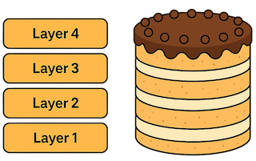

# Lagdeling

## Oppsummering

I denne oppgaven skal vi se på hvordan docker bruker lag.

Lagene i docker images kan sammenliknes med lag på en kake der hvert lag bygger på de andre:




## Hensikt

Demonstrere

- at docker bruker lag for å representere endringer i images
- vi kan opprette `Dockerfile`r for å lage imager som bygger videre på andre images.

## Fremgangsmåte


### Bygg image helloworld

- Bygg image i oppgaven [Hello World](../helloworld/README.md)

### Definer nytt image som bygger på helloworld

- Opprett følgende `Dockerfile` i katalogen `/workspaces/docker_intro/lagdeling`:

```Dockerfile
FROM helloworld
ENV melding="Hello IUR! Nå med lag!"
```

Forklaring:

- linje 1
	- vi skal bygge videre på helloworld
- linje 2
	- vi endrer [miljøvariabelen](../oss/hvaer_miljovariabel.md) `melding`

### Kjør nytt image

- Bygg image og tag det med navn `lagdeling`
- Kjør image


_Tips:_

> Dersom du får en feilmelding her, bygg det manuelt i terminal:
>
>	`docker build --rm -f 'lagdeling/Dockerfile' -t 'lagdeling' 'lagdeling'`

Følgende melding skal vises på skjermen:

```
Melding er: Hello IUR! Nå med lag!
```

- Nå skrives den nye verdien til miljøvariabelen `melding` ut
- Hvis du kjører imaget `helloworld`, skrives den gamle meldingen ut:

```
Melding er: Hello IUR
````

- Vi har nå bygget et nytt image `lagdeling` som bygger videre på `helloworld`

### Inspiser lagene

- Opprett en [ny terminal i Visual Studio](../oss/ny_terminal.md)

- Vi kan inspisere lagene med kommandoen `history`. For å se lagene til `helloworld`, skriv dette i terminalen:

```bash
docker history helloworld
```

- Du skal få en tekst som likner på dette:

```bash
vscode ➜ /workspaces/docker_kurs/lagdeling/skripter (master) $ docker history helloworld
IMAGE          CREATED      CREATED BY                                      SIZE      COMMENT
b04ca4b27355   8 days ago   CMD ["bash" "-c" "echo Melding er: $melding"]   0B        buildkit.dockerfile.v0
<missing>      8 days ago   ENV melding=Hello IUR                           0B        buildkit.dockerfile.v0
<missing>      8 days ago   /bin/sh -c #(nop)  CMD ["/bin/bash"]            0B        
(..))
```

- Legg merke til de to øverste linjene (se kolonne `CREATED BY`):

    - `CMD ["bash" "-c" "echo Melding er: $melding"]`
    - `ENV melding=Hello IUR`

- Dette viser at det er opprettet to lag. Ett lag for hver linje i `Dockerfile`

- For å se lagene til `lagdeling`, skriv dette i terminalen:

```bash
docker history lagdeling
```

- Du skal få en tekst som likner på dette:

```bash
vscode ➜ /workspaces/docker_kurs/lagdeling/skripter (master) $ docker history lagdeling
IMAGE          CREATED      CREATED BY                                      SIZE      COMMENT
71e52e650dda   8 days ago   ENV melding=Hello IUR! Nå med lag!              0B        buildkit.dockerfile.v0
<missing>      8 days ago   CMD ["bash" "-c" "echo Melding er: $melding"]   0B        buildkit.dockerfile.v0
<missing>      8 days ago   ENV melding=Hello IUR                           0B        buildkit.dockerfile.v0
(..)
```

- Legg merke til denne linjen:
    - `ENV melding=Hello IUR! Nå med lag!`

- Dette viser at det er opprettet et nytt lag som ligger oppå de andre lagene

## Opprydning

- Kjør disse to kommandoene i [terminalvinduet](../oss/ny_terminal.md): 
	- `docker image rm lagdeling`
	- `docker image rm helloworld`


Forklaring:

- linjene over er bygget opp av fire deler:
	- `docker` - docker- programmet
	- `image` - angir at vi skal gjøre noe med ett eller flere images
	- `rm` - vi skal slette images
	- `lagdeling` - navn på image

Hvis du vil, kan du også slette de som vist i [oppgaven hello world](../helloworld/README.md)