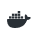
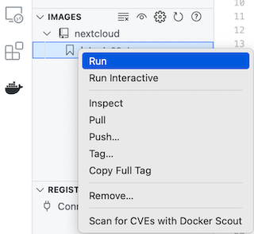
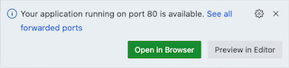
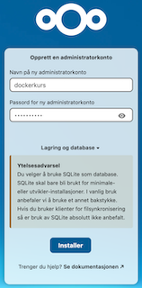
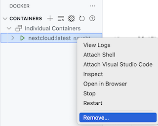
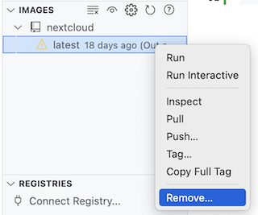

## Oppsummering

I denne oppgaven skal du installere kontorstøttemiljøet Nextcloud.


## Hensikt

Demonstrere

- at docker images kan inneholde ferdig konfigurert systemer
- hvordan man kan installere et ferdig image


## Fremgangsmåte


- Høyreklikk på ```Dockerfile``` i denne mappen
- Velg "Build Image..."
- Når du blir bedt om navn tag, skriv:
    - `nextcloud:latest`

- I terminalvinduet vises tekst som likner på dette:

```
 *  Executing task in folder docker_kurs: docker build --pull --rm -f 'nextcloud/Dockerfile' -t 'nextcloud:latest' 'nextcloud' 

[+] Building 0.5s (5/5) FINISHED                                         docker:default
 => [internal] load build definition from Dockerfile                               0.0s
 => => transferring dockerfile: 217B                                               0.0s
 => [internal] load metadata for docker.io/library/nextcloud:latest                0.5s
 => [internal] load .dockerignore                                                  0.0s
 => => transferring context: 2B                                                    0.0s
 => CACHED [1/1] FROM docker.io/library/nextcloud:latest@sha256:e04ca272d8778c24b  0.0s
 => exporting to image                                                             0.0s
 => => exporting layers                                                            0.0s
 => => writing image sha256:54d445de01322ff111e542da5815e7807ac5fd2995838f0a0d40d  0.0s
 => => naming to docker.io/library/nextcloud:latest                                0.0s

 1 warning found (use docker --debug to expand):
 - SecretsUsedInArgOrEnv: Do not use ARG or ENV instructions for sensitive data (ENV "NEXTCLOUD_ADMIN_PASSWORD") (line 4)
 *  Terminal will be reused by tasks, press any key to close it. 
```

- Klikk på Docker Extention i VSCode:



- Ekspander image "nextcloud", merk "latest" og velg "Run":



- Imaget blir nå startet opp i en kontainer
- Når VSCode viser denne dialogboksen under, klikk på "Open in Browser":



- Etter et minutt eller to starter nextcloud



- Opprett administratorbruker:
    - Navn: dockerkurs
    - Passord: dockerkurs

- Du får nå spørsmål om hvilke "apper" du vil ha i nextcloud

- Deaktiver alle bortsett fra "Talk"

- Klikk på installer anbefalte apper

- Vet et minutt eller to mens nextclod settes opp

- Du får nå en introduksjonsskjerm. Klikk på "X" øverst i høyre kjørne for å lukke

- Klikk på ikonet Samtale for å åpne meldingsfunksjonen:


- Send en melding til deg selv for å sjekke at det fungerer

- Hvis du vil, kan du leke mer med nextcloud, f.eks
    - Se gjennom filene på profilen din
    - Installere flere apper
    - Opprette markdownfil og redigere den


## Opprydning

- I docker extention, merk container og velg remove:



- I docker extention, merk image og velg remove:



