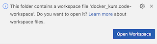
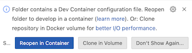
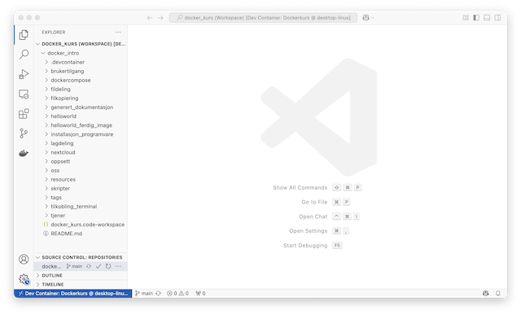

# Oppsett

## Installasjon av programvare

1. Installer WSL (Windows Subsystem for Linux)
    1. Følg instruksen "Install WSL Command" på Microsoft sine sider:
        - https://learn.microsoft.com/en-us/windows/wsl/install#install-wsl-command
1. Installer [Docker Desktop](https://docs.docker.com/get-started/introduction/get-docker-desktop/)
1. Installer [Visual Studio Code](https://code.visualstudio.com/docs/setup/setup-overview)
1. Installer extension "Dev Containers" i VSCode:
    - https://marketplace.visualstudio.com/items?itemName=ms-vscode-remote.remote-containers

## Kloning og åpning av prosjekt

Prosjektet er laget som et versjonskontrollert prosjekt i github.

***OBS!*** Det kan ta inntil 10 minutter å sette opp miljøet.

Det kan klones med Visual Studio Code slik:

- Velg meny: `File` -> `New Window`

Nytt vindu vises. Sjekk ut prosjektet:

- Trykk `Ctrl` + `Shift` + `p` (windows) / `Cmd` + `P` (mac)
- Skriv:
    - `> Git clone`
- Velg Clone from github
- Logg deg inn i github hvis du blir bedt om det
- Skriv:
    - `https://github.com/NVE/docker_intro`
- Velg en valgfri katalog
- Vent til prosjektet er klonet
- Når du får spørsmålet "Would you like to open the cloned repository?", velger du "Open in New Window"

Når prosjektet er åpent, vises disse to meldingene:





- Velg både "Reopen i container" og "Open Workspace"

_Merk! Denne operasjonen kan ta litt tid!_

Du skal nå ha et prosjekt som ser ca. slik ut:



- Sjekk at følgende vises i nederste venstre hjørne:


- Sjekk at følgende Container Tools extension er installert:


## Test

Gjør følgende for å teste at docker fungerer i miljøet:

- [Opprett et nytt terminalvindu i Visual Studio Code](../oss/ny_terminal.md).

Denne kommandolinjen skal vises i Visual Studio Code i terminalvinduet:

```bash
vscode ➜ /workspaces/docker_intro (main) $ 
```

- Lim inn inn denne kommandoen:

```bash
docker run --rm hello-world
```
Denne teksten skal skal vises (noen avvik kan forekomme):

```txt
Unable to find image 'hello-world:latest' locally
latest: Pulling from library/hello-world
c9c5fd25a1bd: Already exists 
Digest: sha256:dd01f97f252193ae3210da231b1dca0cffab4aadb3566692d6730bf93f123a48
Status: Downloaded newer image for hello-world:latest

Hello from Docker!
This message shows that your installation appears to be working correctly.

To generate this message, Docker took the following steps:
 1. The Docker client contacted the Docker daemon.
 2. The Docker daemon pulled the "hello-world" image from the Docker Hub.
    (arm64v8)
 3. The Docker daemon created a new container from that image which runs the
    executable that produces the output you are currently reading.
 4. The Docker daemon streamed that output to the Docker client, which sent it
    to your terminal.

To try something more ambitious, you can run an Ubuntu container with:
 $ docker run -it ubuntu bash
x
Share images, automate workflows, and more with a free Docker ID:
 https://hub.docker.com/

For more examples and ideas, visit:
 https://docs.docker.com/get-started/
```


## Feilsøking

### Rebygging av miljø

Dersom det oppstår feil, forsøk dette:

- Trykk `Ctrl` + `Shift` + `p` (windows) / `Cmd` + `P` (mac)
- Skriv:
    - `> Dev Containers: Rebuild Container Without Cache`

### Full test

For å gjøre en grundig test av at miljøet fungerer, gjør følgende:

- [Opprett et nytt terminalvindu i Visual Studio Code](../oss/ny_terminal.md).

Denne kommandolinjen skal vises i Visual Studio Code i terminalvinduet:

```bash
vscode ➜ /workspaces/docker_intro (main) $ 
```

- Lim inn inn denne kommandoen:

```bash
./skripter/testalt.sh
```

Alle oppgavene skal nå kjøres gjennom og testes.

Merk at dette tar ganske lang tid.

Merk også at det vises noen feilmeldinger om man forsøker å slette containere og images som ikke eksisterer. Det er helt normalt.

### Command failed: C:\VSCode-NVE\Code.exe og Run: docker ps -q -a

Hvis du får følgende feilmeldinger eller liknende:

```
Start: Run: docker ps -q -a --filter label=devcontainer.local_folder=c:\Temp-docker\docker_intro --filter label=devcontainer.config_file=c:\Temp-docker\docker_intro\.devcontainer\devcontainer.json
[58252 ms] Error: Command failed: docker run --sig-proxy=false -a STDOUT -a STDERR --mount type=bind,source=c:\Temp-docker\docker_intro,target=/workspaces/docker_intro,consistency=cached --mount type=volume,src=dind-var-lib-docker-1f46ccrd484ivd9a5mv619904fpsd0n04669semnhasc3hm00aid,dst=/var/lib/docker --mount type=volume,src=vscode,dst=/vscode --mount type=bind,src=\\wsl.localhost\Ubuntu\mnt\wslg\runtime-dir\wayland-0,dst=/tmp/vscode-wayland-a76d3e3a-e92f-4629-9b33-0b81ef9a7051.sock -l devcontainer.local_folder=c:\Temp-docker\docker_intro -l devcontainer.config_file=c:\Temp-docker\docker_intro\.devcontainer\devcontainer.json --privileged --entrypoint /bin/sh vsc-docker_intro-7e368a42f641fd4f5c4f4e9495091c6f64ebe6ac3d79ec234e848c21d6654da2 -c echo Container started
Command failed: C:\VSCode-NVE\Code.exe c:\Users\nick\.vscode\extensions\ms-vscode-remote.remote-containers-0.413.0\dist\spec-node\devContainersSpecCLI.js up --user-data-folder 
```

... gjør dette:

- Åpne Docker Desktop -> Settings -> Resources -> WSL Integration
- Kryss av for «Enable integration with my default WSL distro» og marker også Ubuntu (eller den distribusjonen feilmeldingen viser til).
- Klikk Apply & Restart for å starte Docker Desktop på nytt.
- Gå tilbake til VS Code og kjør «Dev Containers: Rebuild and Reopen in Container».
