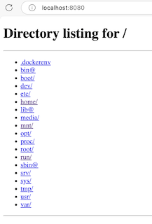

# Tjener


## Oppsummering

I denne oppgaven skal vi se på hvordan vi kan sette opp en enkel webserver i docker.


## Hensikt

Demonstrere

- hvordan vi setter opp en enkel webserver og kobler oss til med nettleser


## Fremgangsmåte


### Opprett image

- - Opprett `Dockerfile` i katalogen `/workspaces/docker_intro/tjener/` med følgene innhold:

```dockerfile
FROM ubuntu
RUN apt update
RUN apt install -y python3
CMD ["python3","-m","http.server","8080"]
EXPOSE 8080
```

- Forklaring:
    - Linje 5:
        - Angir at vi vil dele port 8080

### Bygg og start image

- Bygg og start image (tag denne med navnet `tjener`)
- Visual studio skal nå komme opp med en melding om en åpen port. Velg "Open in Browser"
    - Alternativt, kan du åpne denne adressen i nettleseren din:
        - http://localhost:8080/

- Du skal nå se noe liknende dette i nettleseren:



Du har nå en enkel, kjørende webtjener som viser innholdet i roten i dockercontaineren.

I dette eksempelet vises roten i filsystemet, noe vi vanligvis ikke ønsker. I oppgaven [filkopiering](../filkopiering/README.md) skal vi se på hvordan vi setter opp en webside.


## Opprydning

- Slett containeren
- Slett image


## Neste oppgave

Hvis alt fungerer, kan du begynne på neste oppgave (se [hovedsiden](../README.md))
